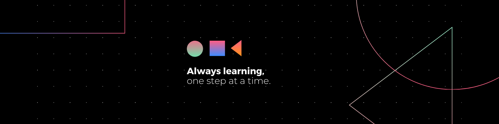

  

---

I'm **Rakshit Vahi** – a passionate **Software Engineer** and **Product Manager in training** with extensive experience in **agile methodologies**, **backend development**, and **CI/CD automation**.

---

## 📞 Contact Me

  
  
  

---

## 🛠️ Skills

#### **Data Tools & Visualization**
- 🖥️ **Tableau**: Interactive Dashboards, Data Visualization
- 🐍 **Python**: Data Cleaning, Analysis
- 📊 **Excel**: Data Reporting, Visualization

#### **Agile Product Management**
- 🏃‍♂️ **Methodologies**: Scrum, Kanban, PI Planning
- 📋 **Tools**: Rally Software, Jira, MS Project, Atlassian Confluence
- 🚀 **Skills**: Roadmap Creation, Market Research, Documentation Writing, Sprint Planning, Backlog Prioritization

#### **Software Development & CI/CD**
- 💻 **Languages**: Java, Python, Go Lang, SQL
- 🔧 **Frameworks & Tools**: Spring Framework, Undertow Framework, Docker, Kubernetes, Jenkins, Git, Gradle, Maven
- 🛠️ **Other Tools**: HP ALM, Figma

---

## 💼 Work Experience

#### **GE Healthcare, India** (Oct 2021 – Jul 2022)
**Software Engineer**
- 🚀 Developed and rolled out microservices, optimizing release cycles with CI/CD.
- 📈 Set KPIs and OKRs, leading to a 20% improvement in service reliability.
- 🤖 Automated CI/CD with Jenkins, Docker, Maven, reducing deployment time by 65%.
- 💼 Collaborated on sprint cycles, backlog prioritization, and JIRA, achieving timely delivery.

#### **Northeastern University ITS, Boston** (Jun 2023 – Present)
**Customer Experience Technician**
- 🔄 Enhanced issue resolution efficiency by 40%, streamlining ticketing with ServiceNow.
- 📚 Created knowledge resources for common technical issues, improving self-service resolution.

---

### 🎓 Academic Projects

#### 🧑‍💼 **Intern Space** (Project Management) | **Sep 2023 – Dec 2023**
- 📅 Created a comprehensive project plan with work breakdown, Gantt charts, and budgeting.
- 🛡️ Developed a risk matrix, reducing potential delays by 40% with proactive mitigation strategies.

#### 💼 **Mentor Wise** (Digital Product Development and Management) | **Jan 2023 – Apr 2023**
- 🔍 Conducted market research, developing MRD and PRD to align features with user needs.
- 🖌️ Utilized Figma for prototyping and visual design, translating requirements into workflows.

#### 📊 **Depression Dataset Visualization** | **Jan 
